# Laporan Resmi Praktikum Sistem Operasi Modul 5

## Identitas

- **Nama:** Nazwa Aulia Dwi Purnomo
- **NRP:** 5027251018
- **Kelas:** Sistem Operasi B
- **Kode Asisten:** KENZ

---

## Struktur Repository

```
SISOP-5-2026-IT-018
└── soal_2
    ├── Makefile
    ├── README.md
    ├── bochsrc.txt
    ├── bootloader.asm
    ├── build.sh
    ├── kernel.asm
    └── kernel.c
```

File yang dimodifikasi hanya `kernel.asm` dan `kernel.c`. File lainnya (`bootloader.asm`, `Makefile`, `bochsrc.txt`, `build.sh`) disediakan sebagai bagian dari template dan tidak perlu diubah.

## Soal 2 - Season

### Penjelasan Soal

Soal ini meminta untuk membangun sebuah mini OS berbasis teks yang berjalan di emulator Bochs (16-bit x86 real mode). Sistem terdiri dari bootloader, kernel assembly, dan kernel C yang saling terhubung. Poin-poin yang harus diimplementasikan adalah:

1. **`_getChar` di `kernel.asm`** Mengisi fungsi `_getChar` agar huruf yang diketik pengguna bisa tampil di layar melalui BIOS interrupt.
2. **`check`** Mencetak `ok` untuk memastikan sistem berjalan dengan benar.
3. **`add`** Perintah penjumlahan dua bilangan bulat. Contoh: `add 5 3` → `8`.
4. **`sub`** Perintah pengurangan dua bilangan bulat. Contoh: `sub 10 2` → `8`.
5. **`fac`** Perintah faktorial dengan batasan integer 16-bit. Input > 8 mencetak `know your limit little bro.`.
6. **`season`** Perintah penggantian warna teks berdasarkan musim: `winter`, `spring`, `summer`, `fall`, dan `radiant`.
7. **`triangle`** Mencetak segitiga dari karakter `X` setinggi `n` baris.
8. **`clear` dan `help`** `clear` membersihkan layar, `help` menampilkan daftar perintah.

---

### Hubungan Antar File

#### Alur Build

`Makefile` (dan `build.sh` untuk macOS) mengotomasi seluruh proses ini. Perintah `make build` menjalankan tiga tahap: `prepare` (buat floppy image kosong), `bootloader` (compile dan tulis bootloader), lalu `kernel` (compile dan tulis kernel). Hasil akhirnya adalah `floppy.img` yang kemudian dijalankan oleh Bochs via `make run`.

#### Konfigurasi Emulator : `bochsrc.txt`

File ini memberitahu Bochs untuk boot dari floppy image (`floppy.img`) yang telah dibuat, dengan kapasitas RAM 32MB dan menggunakan SDL2 sebagai display. Tanpa file ini, Bochs tidak tahu dari mana harus boot.

#### Jembatan BIOS ke Kernel : `bootloader.asm`

Bootloader adalah 512 byte pertama di `floppy.img` (sektor 0). BIOS membacanya ke alamat `0x7C00` dan menjalankannya. Tugas utamanya adalah memuat kernel dari floppy ke memori, lalu menyerahkan kontrol ke kernel.

Bootloader memuat 15 sektor kernel (sektor 2–16) ke segmen memori `0x1000:0000` menggunakan BIOS interrupt `0x13` (disk service). Setelah berhasil, stack dipindah ke `0x9000:FFFF` agar aman, lalu dilakukan far jump ke `0x1000:0000` — tepat di mana kernel dimuat.

#### Entry Point dan Fungsi Assembly : `kernel.asm` 

Kernel assembly adalah kode pertama yang dieksekusi setelah bootloader menyerahkan kontrol. File ini menjadi **jembatan antara dunia assembly dan kode C**.

Direktif `global` mengekspos simbol agar dapat diakses oleh linker, sedangkan `extern _main` memberitahu assembler bahwa fungsi `main` ada di file lain (yaitu `kernel.c`). Fungsi `_start` adalah entry point pertama yang berjalan: ia menyiapkan segment registers (`DS`, `ES` sesuai `CS`) lalu memanggil `_main` dari `kernel.c`. Setelah `_main` kembali (yang idealnya tidak terjadi), program masuk ke infinite loop `.hang`.

Fungsi `_putInMemory` menerima tiga argumen dari C (`segment`, `address`, `character`) melalui stack sesuai calling convention 16-bit.


#### Logika Shell Utama `kernel.c`

File ini berisi seluruh logika aplikasi: fungsi-fungsi utility (I/O, string, matematika) dan loop utama shell. Karena berjalan di sistem 16-bit tanpa OS dan tanpa library standar, semua fungsi seperti `strcmp`, `atoi`, hingga `intToString` diimplementasikan sendiri dari nol.

---

#### Penjelasan Lengkap `kernel.c`

##### Variabel Global

```c
int cursor = 0;
char color = 0x07;
```

`cursor` menyimpan posisi karakter saat ini (0–1999, karena layar VGA teks 80×25 = 2000 karakter). `color` menyimpan atribut warna VGA: nibble tinggi adalah warna latar belakang, nibble rendah adalah warna teks. Nilai `0x07` berarti teks putih di latar hitam.

Dua fungsi dideklarasikan extern karena implementasinya ada di `kernel.asm`:

```c
void putInMemory(int segment, int address, char character);
int getChar();
```

##### `printChar(char c)`

```c
void printChar(char c)
{
    putInMemory(0xB800, cursor * 2, c);
    putInMemory(0xB800, cursor * 2 + 1, color);
    cursor++;
}
```

Fungsi ini menulis satu karakter ke Video RAM (VRAM) di segmen `0xB800`. VRAM teks VGA menyimpan dua byte per karakter: byte genap adalah kode ASCII karakter, byte ganjil adalah atribut warna. Sehingga karakter di posisi `cursor` ada di offset `cursor * 2`, dan atributnya di `cursor * 2 + 1`.

##### `printString(char* str)`

```c
void printString(char* str)
{
    int i = 0;
    while (str[i] != 0)
    {
        printChar(str[i]);
        i++;
    }
}
```

Iterasi string sampai null terminator (`\0`), mencetak tiap karakter satu per satu via `printChar`. Tidak ada library `printf` di sini — semua dilakukan manual.

##### `newline()`

```c
void newline()
{
    int r = cursor;
    while (r >= 80)
        r = r - 80;
    cursor = cursor + (80 - r);
}
```

Fungsi ini menggeser `cursor` ke kolom 0 baris berikutnya. Karena layar 80 kolom, `r` dihitung sebagai posisi kolom saat ini (sisa pembagian 80, dilakukan manual tanpa operator `%`). Kemudian cursor maju sebanyak `80 - r` agar mencapai awal kolom baris berikutnya.

##### `clearScreen()`

```c
void clearScreen()
{
    int i;
    for (i = 0; i < 2000; i++)
    {
        putInMemory(0xB800, i * 2, ' ');
        putInMemory(0xB800, i * 2 + 1, color);
    }
    cursor = 0;
}
```

Menulis spasi ke seluruh 2000 posisi karakter di VRAM (80 kolom × 25 baris), sekaligus meng-update atribut warna tiap posisi dengan `color` saat ini. Setelah selesai, `cursor` direset ke 0 (pojok kiri atas).

##### `readString(char* buf)`

```c
void readString(char* buf)
{
    int i = 0;
    char c;

    while (1)
    {
        c = getChar();

        if (c == 13)
        {
            buf[i] = 0;
            return;
        }

        if (c == 8)
        {
            if (i > 0)
            {
                i--;

                cursor--;

                putInMemory(0xB800, cursor * 2, ' ');
                putInMemory(0xB800, cursor * 2 + 1, color);
            }
        }
        else
        {
            buf[i] = c;
            i++;

            printChar(c);
        }
    }
}
```

Membaca input karakter per karakter dari keyboard via `getChar()`. Karakter 13 adalah Enter (CR) — mengakhiri input dan menambahkan null terminator. Karakter 8 adalah Backspace — menghapus karakter terakhir dari buffer dan dari layar (tulis spasi di posisi tersebut lalu mundurkan cursor). Karakter lainnya disimpan ke buffer dan langsung dicetak ke layar (echo).

##### `strcmp(char* a, char* b)`

```c
int strcmp(char* a, char* b)
{
    int i = 0;
    while (a[i] != 0 && b[i] != 0)
    {
        if (a[i] != b[i])
            return 0;
        i++;
    }
    if (a[i] == 0 && b[i] == 0)
        return 1;
    return 0;
}
```

Implementasi manual perbandingan string. **Perhatian:** fungsi ini mengembalikan `1` jika sama dan `0` jika berbeda — kebalikan dari `strcmp` standar C. Ini disengaja agar bisa langsung dipakai dalam kondisi `if`.

##### `startsWith(char* str, char* prefix)`

```c
int startsWith(char* str, char* prefix)
{
    int i = 0;
    while (prefix[i] != 0)
    {
        if (str[i] != prefix[i])
            return 0;
        i++;
    }
    return 1;
}
```

Mengecek apakah string `str` diawali oleh `prefix`. Iterasi sampai akhir prefix — jika ada satu karakter yang tidak cocok, langsung return `0`. Digunakan untuk mendeteksi perintah yang memiliki argumen seperti `add`, `sub`, `fac`, `season`, dan `triangle`.

##### `atoi(char* str)`

```c
int atoi(char* str)
{
    int n = 0;
    int i = 0;
    int sign = 1;

    if (str[0] == '-')
    {
        sign = -1;
        i = 1;
    }

    while (str[i] != 0)
    {
        n = n * 10;
        n = n + (str[i] - '0');

        i++;
    }

    return n * sign;
}
```

Konversi string angka ke integer. Menggunakan algoritma Horner: di setiap langkah, nilai saat ini dikalikan 10 lalu ditambah digit baru. `str[i] - '0'` mengkonversi karakter ASCII ke nilai numeriknya (misalnya `'5'` → `5`).

##### `intToString(int n, char* buf)`

```c
void intToString(int n, char* buf)
{
    int i = 0;
    int count;
    int started = 0;

    if (n < 0)
    {
        buf[i] = '-';
        i++;
        n = -n;
    }

    if (n == 0)
    {
        buf[i++] = '0';
        buf[i] = 0;
        return;
    }


    count = 0;
    while (n >= 10000)
    {
        n = n - 10000;
        count++;
    }

    if (count > 0)
    {
        buf[i++] = count + '0';
        started = 1;
    }


    count = 0;
    while (n >= 1000)
    {
        n = n - 1000;
        count++;
    }

    if (count > 0 || started)
    {
        buf[i++] = count + '0';
        started = 1;
    }


    count = 0;
    while (n >= 100)
    {
        n = n - 100;
        count++;
    }

    if (count > 0 || started)
    {
        buf[i++] = count + '0';
        started = 1;
    }


    count = 0;
    while (n >= 10)
    {
        n = n - 10;
        count++;
    }

    if (count > 0 || started)
    {
        buf[i++] = count + '0';
    }


    buf[i++] = n + '0';
    buf[i] = 0;
}
```

Konversi integer ke string tanpa operator `/` dan `%` (yang tidak tersedia di toolchain 16-bit ini). Sebagai gantinya, digunakan pengurangan berulang untuk mengekstrak digit per digit dari posisi puluhan-ribu, ribuan, ratusan, puluhan, dan satuan. Variabel `i > 0` digunakan sebagai flag agar angka nol di awal tidak dicetak (misalnya `42` tidak menjadi `00042`).

##### `factorial(int n)`

```c
int factorial(int n)
{
    int i;
    int result = 1;
    for (i = 2; i <= n; i++)
        result = result * i;
    return result;
}
```

Menghitung faktorial secara iteratif. Loop mulai dari 2 karena `1! = 0! = 1` sudah ditangani oleh nilai awal `result = 1`.

##### `nextToken(char* str)`

```c
char* nextToken(char* str)
{
    while (*str != 0 && *str != ' ')
    {
        str++;
    }

    if (*str == ' ')
    {
        *str = 0;
        str++;
    }

    return str;
}
```

Memotong string di spasi pertama yang ditemukan (dengan menggantinya menjadi null terminator `\0`), lalu mengembalikan pointer ke karakter setelah spasi tersebut. Fungsi ini dipakai untuk memisahkan dua argumen pada perintah `add` dan `sub`. Misalnya string `"14 2"` akan diubah menjadi `"14\02"` — sehingga pointer awal menunjuk ke `"14"` dan pointer kembalian menunjuk ke `"2"`.

##### `main()` — Loop Utama Shell

```c
void main()
{
    char cmd[64];
    clearScreen();
    printString("Welcome");
    newline();
    printString("type help");
    newline();
    newline();

    while (1)
    {
        printString("> ");
        readString(cmd);
        newline();

        if (strcmp(cmd, "check"))         { ... }
        else if (strcmp(cmd, "help"))     { ... }
        else if (strcmp(cmd, "about"))    { ... }
        else if (strcmp(cmd, "clear"))    { ... }
        else if (startsWith(cmd, "add ")) { ... }
        else if (startsWith(cmd, "sub ")) { ... }
        else if (startsWith(cmd, "fac ")) { ... }
        else if (startsWith(cmd, "season "))   { ... }
        else if (startsWith(cmd, "triangle ")) { ... }

        newline();
    }
}
```

Fungsi `main` adalah inti dari OS ini. Setelah inisialisasi (clear layar dan cetak welcome message), program masuk ke infinite loop yang terus mencetak prompt `> `, membaca input dari pengguna, lalu mencocokkan input dengan perintah yang ada menggunakan rantai `if-else`. Perintah yang tepat sama (tanpa argumen) dicocokkan dengan `strcmp`, sedangkan perintah yang memiliki argumen dicocokkan dengan `startsWith`.

---

### Penyelesaian Soal

#### Poin 1 — Implementasi `_getChar` di `kernel.asm`

Fungsi `_getChar` diimplementasikan menggunakan BIOS interrupt `0x16` dengan service `AH = 0x00`. Interrupt ini memblok eksekusi hingga pengguna menekan tombol, lalu mengembalikan karakter ASCII di register `AL` dan scan code di `AH`.

```asm
_getChar:
    mov ah, 0x00
    int 0x16
    xor ah, ah
    ret
```

Setelah interrupt, `xor ah, ah` membersihkan `AH` sehingga nilai return (`AX`) hanya berisi kode ASCII di `AL`. Ini penting karena calling convention 16-bit menggunakan `AX` sebagai register return value — jika `AH` tidak dibersihkan, fungsi `getChar()` di sisi C akan menerima nilai yang salah.

Tanpa implementasi ini, fungsi `readString` di `kernel.c` tidak bisa menerima input apapun dari pengguna karena `getChar()` tidak mengembalikan nilai yang benar.

#### Poin 2 — Perintah `check`

```c
if (strcmp(cmd, "check"))
{
    printString("ok");
}
```

Ketika pengguna mengetik `check` dan menekan Enter, `strcmp(cmd, "check")` mengembalikan `1` (string identik), sehingga `printString("ok")` dieksekusi. Ini berfungsi sebagai verifikasi dasar bahwa pipeline input → proses → output berjalan dengan benar.

#### Poin 3 — Perintah `add`

```c
else if (startsWith(cmd, "add "))
{
    char* p;
    char* q;
    int a;
    int b;
    char out[16];

    p = cmd + 4;
    q = nextToken(p);

    a = atoi(p);
    b = atoi(q);

    intToString(a + b, out);
    printString(out);
}
```

`cmd + 4` melewati prefix `"add "` (4 karakter) sehingga `p` langsung menunjuk ke argumen pertama. `nextToken(p)` memotong string di spasi dan mengembalikan pointer ke argumen kedua. Kedua string angka dikonversi ke integer via `atoi`, dijumlahkan, lalu hasilnya dikonversi kembali ke string via `intToString` sebelum dicetak.

#### Poin 4 — Perintah `sub`

```c
else if (startsWith(cmd, "sub "))
{
    char* p;
    char* q;
    int a;
    int b;
    char out[16];

    p = cmd + 4;
    q = nextToken(p);

    a = atoi(p);
    b = atoi(q);

    intToString(a - b, out);
    printString(out);
}
```

Identik dengan `add` dari segi struktur parsing argumen. Perbedaannya hanya pada operasi aritmetika: `a - b` menggantikan `a + b`.

#### Poin 5 — Perintah `fac`

```c
else if (startsWith(cmd, "fac "))
{
    int n;
    char out[16];

    n = atoi(cmd + 4);

    if (n > 8)
    {
        printString("know your limit little bro.");
    }
    else
    {
        intToString(factorial(n), out);
        printString(out);
    }
}
```

Sistem berjalan di real mode 16-bit di mana integer adalah 16-bit signed (range -32768 hingga 32767). Faktorial 8 = 40320 — ini sudah melebihi batas 16-bit signed namun masih representable sebagai 16-bit unsigned. Faktorial 9 = 362880 yang jelas overflow. Batasan di angka 8 dipilih karena `intToString` hanya menangani hingga 5 digit (maksimum 99999), dan hasil faktorial yang overflow akan menghasilkan nilai yang salah.

#### Poin 6 — Perintah `season`

```c
else if (startsWith(cmd, "season "))
{
    char* s;
    s = cmd + 7;

    if (strcmp(s, "winter"))
        color = 0x09;
    else if (strcmp(s, "spring"))
        color = 0x0A;
    else if (strcmp(s, "summer"))
        color = 0x0E;
    else if (strcmp(s, "fall"))
        color = 0x0C;
    else if (strcmp(s, "radiant"))
        color = 0x0D;
}
```

`cmd + 7` melewati prefix `"season "` (7 karakter). Variabel `color` yang diubah di sini adalah variabel global yang digunakan oleh `printChar` dan `clearScreen` — sehingga seluruh teks yang dicetak setelah perintah ini akan menggunakan warna baru. Pemetaan warna VGA:

| Perintah | Color Code | Warna |
|----------|-----------|-------|
| `winter` | `0x09` | Biru terang |
| `spring` | `0x0A` | Hijau terang |
| `summer` | `0x0E` | Kuning |
| `fall`   | `0x0C` | Merah terang |
| `radiant`| `0x0D` | Magenta terang |

#### Poin 7 — Perintah `triangle`

```c
else if (startsWith(cmd, "triangle "))
{
    int n;
    int row;
    int col;

    n = atoi(cmd + 9);

    row = 1;

    while (row <= n)
    {
        col = 0;

        while (col < row)
        {
            printChar('X');
            col++;
        }

        newline();

        row++;
    }
}
```

`cmd + 9` melewati prefix `"triangle "` (9 karakter). Loop luar berjalan dari `i = 1` hingga `n` (jumlah baris), dan loop dalam mencetak `i` karakter `X` pada baris ke-`i`. Setelah setiap baris, `newline()` dipanggil untuk pindah baris. Hasilnya adalah segitiga siku-siku rata kiri.

#### Poin 8 — Perintah `clear` dan `help`

```c
else if (strcmp(cmd, "help"))
{
    printString("check add sub fac season triangle clear about");
}
else if (strcmp(cmd, "clear"))
{
    clearScreen();
}
```

`help` mencetak semua perintah yang tersedia dalam satu baris. `clear` memanggil `clearScreen()` yang menulis ulang seluruh 2000 posisi VRAM dengan spasi berberkecolor saat ini dan mereset `cursor` ke 0.

---

### Dokumentasi

#### 1. Tampilan awal sistem setelah booting di Bochs yakni welcome message dan prompt `>`
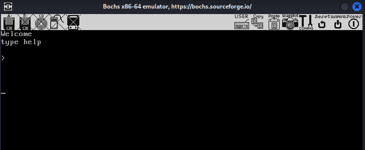 <br>
#### 2. Output perintah `check` — mencetak `ok`
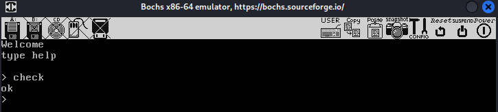 <br>
#### 3. Output perintah `add 5 3` — mencetak `8`
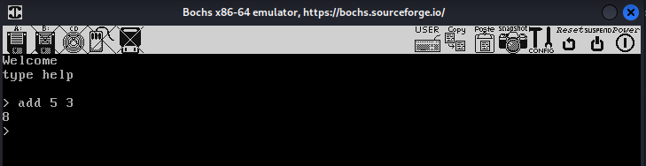 <br>
#### 4. Output perintah `sub 10 2` — mencetak `8`
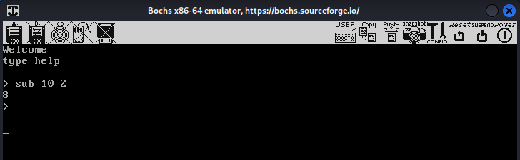 <br>
#### 5. Output perintah `fac 6` — mencetak `720`
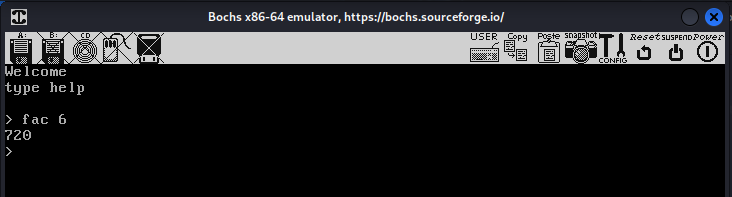 <br>
#### 6. Output perintah `fac 120` — mencetak `know your limit little bro.`
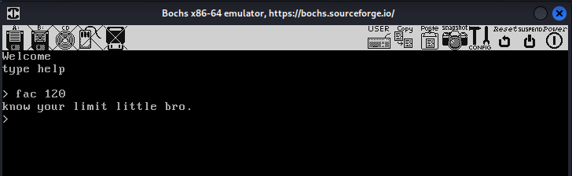 <br>
#### 7. Output perintah `season winter` hingga `season radiant` — perubahan warna teks tiap musim
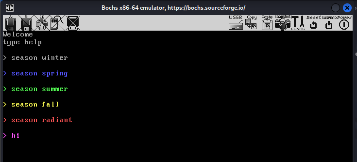
#### 8. Output perintah `triangle 5` — segitiga X setinggi 5 baris
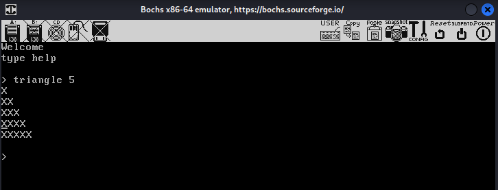 <br>
#### 9. Output perintah `help` — daftar semua perintah
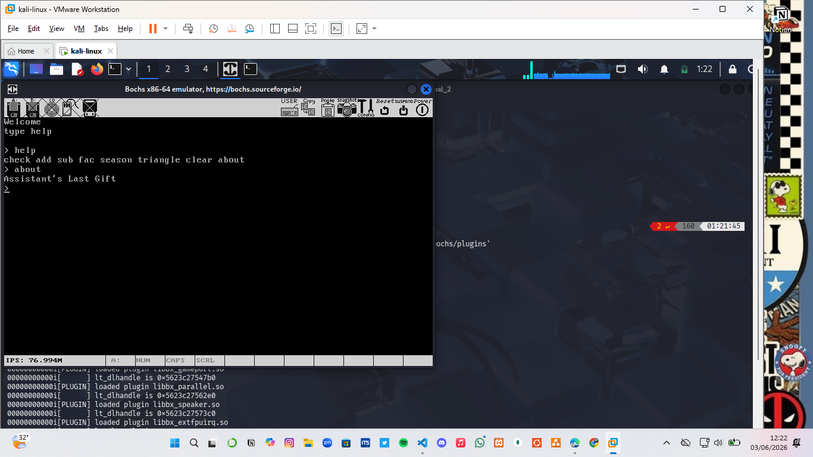 <br>
#### 10. Output perintah `clear` — layar bersih, cursor kembali ke pojok kiri atas
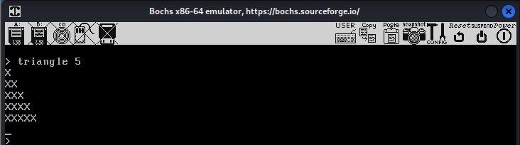 <br>
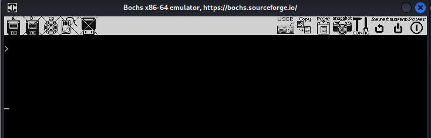 <br>


---

### Kendala
Tidak ada.